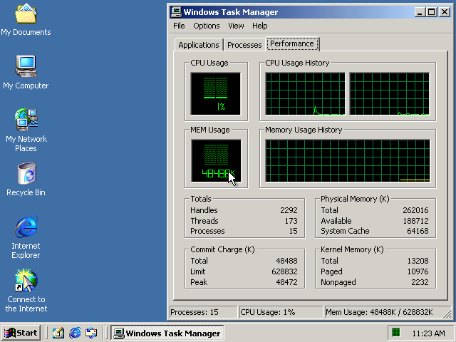

# Alphabox

**An AlphaServer ES40 emulator** (formerly AXPbox).

[](https://github.com/artur/alphabox/actions/workflows/build-test-and-artifact.yml)
[](LICENSE)

Alphabox emulates an HP/DEC AlphaServer ES40 — one to four Alpha EV68 CPUs on
the Tsunami/Typhoon chipset — well enough to run the operating systems of the
Alpha era: OpenVMS, Tru64 UNIX, NetBSD and Windows NT/2000. It runs on x86-64
and AArch64 hosts under Linux, macOS and Windows.

| OpenVMS 8.4 with the CDE desktop | Windows 2000 (build 2128) | Windows 2000 on two processors |
|---|---|---|
|  |  |  |

## Features

- **Real firmware.** Boots the genuine SRM console and, from it, the
  ARC/AlphaBIOS console; graphics cards run their real VGA BIOS.
- **Fast.** An asmjit-based JIT for x86-64 and AArch64 hosts (Apple Silicon
  included), with block chaining, register pinning, extended blocks, a
  host-side page cache and an indexed TB with a shadow of evicted
  translations. About 3000 MIPS on real guest code on an Apple M3 Max --
  two to three times the ES40's own processor. An interpreter build is
  always available too.
- **Real drivers, not just real firmware.** Every emulated adapter is driven
  by the console's own driver -- network boot included -- and, where the
  media carries one, by a guest's: Windows 2000 binds its Symbios, QLogic,
  S3, Cirrus and ATI drivers to these devices with nothing supplied. That is
  how most of their bugs were found; a real driver asks questions a test
  never thinks of.
- **Quiet when idle.** Idle pacing recognizes the guest's idle loops and
  sleeps until an interrupt arrives, so an idle guest costs a few percent of
  a host core.
- **SMP and large memory.** Up to four CPUs and up to 32 GB of RAM,
  presented to the firmware with matching memory arrays and DIMM data.
- **Removable media done carefully.** CD and floppy images are validated
  before insertion, swapped between guest commands, and respect guest
  drive locks; BIN/CUE images are supported.
- **Scriptable.** Runs without a window, dumps the screen, and accepts
  scripted keyboard and mouse input — handy for automated installs and
  tests.

## Emulated hardware

| Area | Devices |
|---|---|
| Machine | AlphaServer ES40; the DS20E, DS10 and DS20L consoles all run to their prompt ([docs/platforms.md](docs/platforms.md)) |
| CPU | 1–4 × Alpha EV68CB (21264) |
| Chipset | Tsunami/Typhoon: Cchip, Dchip, 2 × Pchip, TIG, DPR/RMC |
| Memory | 64 MB – 32 GB |
| Storage | Symbios 53C810 / 53C825 / 53C875 / 53C895 / 53C896 (two channels) and QLogic ISP1020 / ISP1040 (KZPBA) / ISP1080 / ISP1240 (two buses on one function) SCSI, ALi M1543C IDE (disks and ATAPI CD-ROM), 82077AA floppy, RAM disk |
| ISA bridge | ALi M1543C: 8259 PIC, 8254 PIT, MC146818 RTC, 8237 DMA, SuperIO, PMU |
| Graphics | S3 Trio64 (with IBM 8514/A acceleration); Cirrus Logic CL-GD5430 / CL-GD5434 (with BitBLT); ATI Mach64 CT / 264VT2 (drawing engine, hardware cursor, a monitor on the DDC lines, modes to 32 bpp) |
| Network | DEC 21040 / 21041 / 21140 / 21143 (Tulip); Intel 82557/82558/82559 (DE600-AA) and the two-port DE602-AA / DE602-B boards behind a bridge — host access through pcap, TUN/TAP (Linux), a UDP link or a null back end |
| Sound | Ensoniq AudioPCI ES1370 and ES1371 (AC'97 codec and sample-rate converter) |
| Expansion | DECchip 21050/21052/21152/21153/21154 PCI-PCI bridges (nested buses, multi-port boards) |
| Other | OHCI USB, 2 × 16550 serial ports (telnet or unconnected), keyboard and PS/2 mouse, flash and NVRAM persistence |

[docs/peripherals.md](docs/peripherals.md) lists every device the ES40
firmware knows and which ones are coming next.

## Guest operating systems

| Guest | Notes |
|---|---|
| OpenVMS | Boots, including the CDE desktop ([installation guide](https://github.com/lenticularis39/axpbox/wiki/OpenVMS-installation-guide)) |
| Tru64 UNIX | Boots |
| NetBSD | Boots ([installation guide](https://github.com/lenticularis39/axpbox/wiki/NetBSD-9.2-install-guide)) |
| Windows NT / 2000 | Through AlphaBIOS, on the S3, Cirrus or ATI Mach64 graphics card, each with its own driver from the installation media; Windows 2000 with up to two CPUs ([installation guide](https://web.archive.org/web/20260705122517/https://www.zx.net.nz/computers/dec/axpemu-es40.shtml)) |

See also the upstream [guest support](https://github.com/lenticularis39/axpbox/wiki/Guest-support)
page.

## Quick start

```
git clone --recurse-submodules https://github.com/artur/alphabox
cd alphabox
cmake -S . -B build
cmake --build build -j
./build/alphabox configure    # writes es40.cfg
./build/alphabox run
```

You also need an SRM console ROM image, and a VGA BIOS for the graphics card.
The [documentation](docs/README.md) covers the details:

- [Building](docs/building.md) on Linux, macOS and Windows, and enabling the
  JIT
- [Running and configuring](docs/configuration.md): firmware, consoles,
  networking, media, hotkeys
- [Headless operation and debug hooks](docs/headless.md)
- [Development and testing](docs/development.md)

## Performance

With the JIT build on an Apple M3 Max, real guest code -- a Windows 2000
application benchmark that isolates one JIT datapath per section -- runs at
about 3000 MIPS per emulated CPU (2200 to 4000 depending on the section),
about 1.35 host cycles per Alpha instruction; a tight arithmetic loop that
never leaves a block runs at 4600 MIPS and a load/store loop at 3300. The
ES40's own EV68 at 667 MHz managed roughly 1300 to 1500 in practice, the
fastest Alpha ever built about 10300. Over 99 % of guest
instructions execute as host code. An idle two-CPU Windows 2000 desktop
uses about 3-6 % of one host core, and reaches its desktop in about a
minute.

The measurements that got here are in
[docs/performance.md](docs/performance.md), each one made inside one binary
with a runtime switch and recorded with its prediction, because two builds
of the same code differ by 5-10 % per section from code layout alone. A
resumed desktop snapshot (`nt_snap.sh`) makes such an A/B a matter of
minutes.

A MIPS figure taken from a running guest is worth less than it looks, and
the two changes that moved the clock furthest were not about executing code
faster at all. A guest scrolling a console window is waiting for the drawing
engine, and a booting one used to spend its time waiting: two thirds of a
Windows 2000 boot was a driver spinning on the cycle counter for real time
to pass, and the firmware asked for an instruction-cache flush millions of
times without having written a byte of code. Handing that busy-wait the
cycles it was waiting for took the boot from 95 to 60 seconds, and answering
the empty flush cheaply took the SRM console at its prompt from 441 to 1681
MIPS -- while three throughput wins in the same week moved the boot clock by
nothing at all. Profile where the guest waits before optimizing how fast it
runs.

[docs/performance.md](docs/performance.md) has the measurements, what bounds
which workload, and the optimizations that turned out not to pay.

## Known limitations

- More than two CPUs in a guest: SRM runs with four, but Windows 2000
  Professional is licensed for two, and the Windows 2000 Server beta HAL
  only sends inter-processor interrupts to CPUs 0–1. OpenVMS and Tru64 are
  untested with more than one CPU.
- Big-endian hosts.
- Some SCSI and IDE commands; copying large files from an IDE CD-ROM to an
  IDE disk can fail (this rarely affects an OpenVMS installation).
- Cirrus screen-to-system BitBLT transfers (Windows 2000 does not use them),
  and the Mach64's video overlay.
- The guest's cycle counter runs ahead of real time: a driver busy-waiting on
  `RPCC` is handed the cycles it is waiting for instead of spinning through
  them, which used to be 62 of the 95 seconds of a Windows 2000 boot. A guest
  that compares `RPCC` against the interval timer therefore sees a faster
  processor than the one configured; time of day is unaffected.
  `ALPHABOX_STALL_SKIP=0` restores the real wait. Every knowing divergence
  from a real 21264 is listed in
  [docs/cpu-fidelity.md](docs/cpu-fidelity.md).

## History and acknowledgements

Alphabox began as **es40**, the emulator by **Camiel Vanderhoeven** and the
ES40 Emulator Project (2007–2010), with later work by **Tim Stark**
(fsword7). **Tomáš Glozar** revived it as
[AXPbox](https://github.com/lenticularis39/axpbox) — CMake, a single binary,
modern C++ threading and many crash fixes — with **Remy van Elst**. The
[ES40-Emu](https://github.com/ES40-Emu/es40) project (gdwnldsKSC) continues
es40 in parallel and is a welcome source of ideas: each of its changes is
reviewed on its merits here and adopted, adapted or improved.

This repository continued AXPbox as its own project and was renamed Alphabox
in 2026. Its work includes the AArch64 JIT and the performance work behind
it, idle pacing, SMP and memory fixes, removable-media handling,
configurable hotkeys, and the headless test tooling -- and most of the
device families above: the Symbios 53C8xx and QLogic ISP SCSI adapters, the
Tulip and Intel 8255x network cards, the PCI-PCI bridges and the multi-port
boards built on them, the Ensoniq sound cards, and the Cirrus Logic and ATI
Mach64 graphics cards with their drawing engines. Machines other than the
ES40 are being brought up the same way.

Alphabox builds on the work of others:

- **MAME** — the VGA core and IBM 8514/A emulation (Barry Rodewald, Aaron
  Giles, Vas Crabb, Olivier Galibert; BSD-3-Clause).
- **Bochs** — the GUI layer (MandrakeSoft) and parts of the disk and CD-ROM
  command handling.
- **QEMU** — the ES1370 sound device (Vassili Karpov); its Cirrus model was
  the behavioural reference and the test oracle for the Cirrus blitter.
- **POCO** — the original threading wrappers (Applied Informatics).
- **86Box** — the ATI Mach64 drawing engine is ported from it (Sarah Walker,
  Miran Grca, Connor Hyde; GPL-2); its ROM set supplies the VGA BIOS images,
  and its Cirrus model was a reference.
- **SDL3**, **asmjit**, **libpcap** and **Npcap**.

Guest-visible identifiers (disk serial numbers, the `es40.cfg` file name, the
machine type) deliberately keep their ES40 names.

## License

GNU General Public License, version 2 or later — see [LICENSE](LICENSE).
Third-party code keeps its original license, as noted in the source file
headers.
