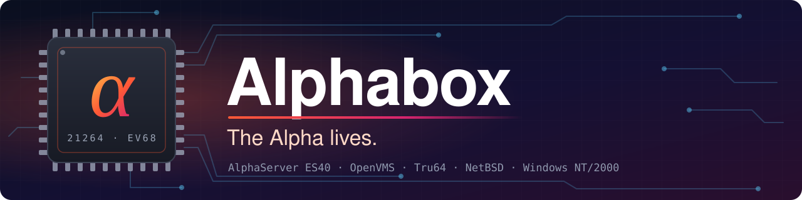
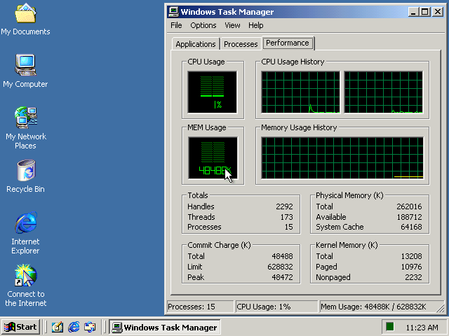
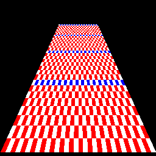
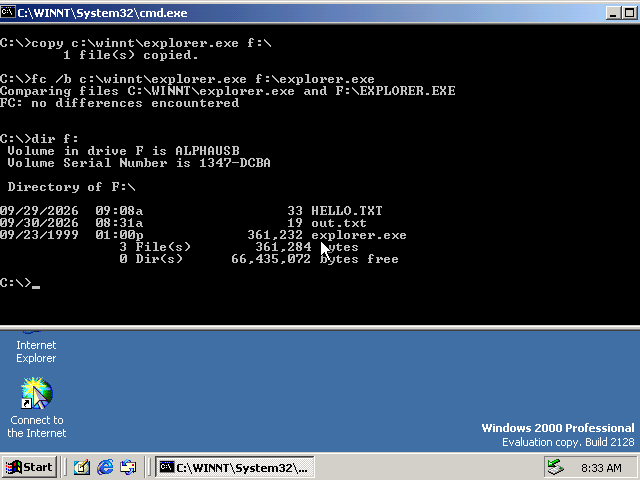
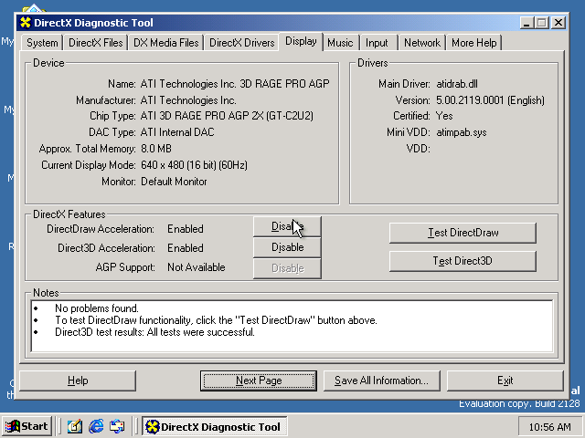

<p align="center">
  
</p>

**Alphabox brings DEC's Alpha -- the fastest processor of the 1990s -- back
to life.** It emulates an HP/DEC AlphaServer ES40 closely enough to boot its
own firmware and the operating systems of its era: OpenVMS, Tru64 UNIX,
NetBSD, Windows NT and Windows 2000, and even the 64-bit Windows Microsoft
never shipped. On a laptop it runs Alpha code **faster than the machine it
emulates ever did.**

[](https://github.com/artur/alphabox/actions/workflows/build-test-and-artifact.yml)
[](LICENSE)

| OpenVMS 8.4 with the CDE desktop | Windows 2000 on two Alpha processors | Direct3D on an emulated ATI 3D Rage Pro |
|---|---|---|
|  |  |  |

## Why Alpha

In 1992 Digital Equipment Corporation shipped the Alpha 21064: a clean-sheet
64-bit RISC processor designed to last twenty-five years, and for most of
the decade the fastest microprocessor in the world. It ran OpenVMS, Digital
UNIX and Windows NT; Microsoft brought up its first 64-bit Windows on it.
Then Compaq bought Digital, HP bought Compaq, the road map went to Itanium,
and the last new Alpha appeared in 2004. The machines are rare now, their disks
are dying, and their software -- a whole branch of computing history -- is
running out of places to run.

Alphabox is one of those places. It is not a model of a generic "Alpha":
it is a specific, real machine -- the AlphaServer ES40, one to four EV68
processors on the Tsunami chipset -- emulated down to its firmware, its
chipset registers, its interrupt wiring and the individual chips on its
cards, so that software written for the real thing runs unmodified.

## At a glance

- **Real firmware, real drivers.** Boots the genuine SRM console and, from
  it, AlphaBIOS; graphics cards run their own VGA BIOS. Windows 2000 binds
  its own drivers -- Symbios, QLogic, S3, Cirrus, ATI, 3Dlabs, USB -- to
  the emulated chips with nothing supplied. A real
  driver asks questions a test never thinks of; that is how most of the
  device bugs were found.
- **Faster than the original.** A JIT compiler for x86-64 and AArch64 hosts
  (Apple Silicon included) runs Alpha code at about **3000 MIPS** on one
  Apple M3 Max core -- two to three times the ES40's own 667 MHz EV68.
  Over 99% of guest instructions execute as host code.
- **Up to four CPUs and 32 GB of memory**, presented to the firmware with
  matching memory arrays and DIMM data.
- **3D graphics from 1998.** The ATI 3D Rage Pro's triangle setup engine,
  the 3Dlabs Permedia 2's delta unit and the S3 ViRGE family's S3d engine are
  emulated: Windows 2000's own Direct3D drivers draw lit, textured,
  perspective-correct scenes on them.
- **USB, 1.1 and 2.0.** The ES40's own OHCI controller and a USB 2.0 card,
  with a tablet that makes the guest's pointer follow yours, USB disks from
  any image, and passthrough of real host devices.
- **Drivers the Alpha never had.** No Windows for Alpha ever shipped a USB
  2.0 driver. With the companion project *nada* -- a C compiler that targets
  Alpha Windows, 32- and 64-bit, user mode and kernel mode -- a new one was
  written, and Windows 2000/Alpha reads USB 2.0 disks with it today -- as well
as paravirtual virtio disk and network drivers for the emulator's own
virtio devices.
- **Quiet when idle.** Idle pacing recognizes the guest's idle loop and
  sleeps until an interrupt arrives; an idle Windows desktop costs a few
  percent of one host core.
- **Scriptable.** Runs without a window, dumps the screen, takes scripted
  keyboard, mouse and USB-fault input -- automated installs, benchmarks and
  driver tests all run headless.

## What runs

| Guest | Status |
|---|---|
| OpenVMS | 8.4 installs from its CD and boots to login on one, two or four CPUs; DECwindows draws the CDE login box on the 3Dlabs Permedia 2 (a session needs a DW-MOTIF licence) ([OpenVMS notes](docs/openvms.md), [installation guide](https://github.com/lenticularis39/axpbox/wiki/OpenVMS-installation-guide)) |
| Tru64 UNIX | Boots |
| NetBSD | Boots ([installation guide](https://github.com/lenticularis39/axpbox/wiki/NetBSD-9.2-install-guide)) |
| Windows NT / 2000 | Installs and runs through AlphaBIOS, on the S3, Cirrus, ATI Mach64, 3Dlabs Permedia 2 or S3 ViRGE/DX card with each card's own driver from the installation media (an installed Windows 2000 also takes the original ViRGE, the ViRGE/VX and the ViRGE/GX2, installing their driver when it finds the card, and the DEC TGA, ZLXp-E1, with its own tga driver); Windows 2000 on up to two CPUs; USB with its own drivers ([installation guide](https://web.archive.org/web/20260705122517/https://www.zx.net.nz/computers/dec/axpemu-es40.shtml)) |
| Windows "Whistler" 64-bit (AXP64, build 2210) | The 64-bit Windows Microsoft developed on Alpha and never released: installs and runs through AlphaBIOS, and runs native 64-bit programs |

| Windows 2000 reading a USB disk | dxdiag: ATI's own Direct3D driver, every test passed | Direct3D through the 3Dlabs Permedia 2's delta unit |
|---|---|---|
|  |  |  |

See also the upstream [guest support](https://github.com/lenticularis39/axpbox/wiki/Guest-support)
page.

## Quick start

```
git clone --recurse-submodules https://github.com/artur/alphabox
cd alphabox
cmake -S . -B build
cmake --build build -j
./build/alphabox configure    # writes es40.cfg
./build/alphabox run
```

You also need an SRM console ROM image, and a VGA BIOS for the graphics
card. The [documentation](docs/README.md) covers the rest:

- [Building](docs/building.md) on Linux, macOS and Windows, and enabling the
  JIT
- [Running and configuring](docs/configuration.md): firmware, consoles,
  networking, media, hotkeys
- [USB](docs/usb.md): the controllers, the tablet, USB disks, passthrough
- [Headless operation and debug hooks](docs/headless.md)
- [Development and testing](docs/development.md)

## Emulated hardware

| Area | Devices |
|---|---|
| Machine | AlphaServer ES40; the DS20E, DS20L (one and two processors) and DS10 boot OpenVMS 8.4; the ES47 (two EV7s) boots OpenVMS 8.4 from its CD to the installation menu ([docs/platforms.md](docs/platforms.md)) |
| CPU | 1–4 × Alpha EV68CB (21264) |
| Chipset | Tsunami/Typhoon: Cchip, Dchip, 2 × Pchip, TIG, DPR/RMC |
| Memory | 64 MB – 32 GB |
| Storage | Symbios 53C810 / 53C825 / 53C875 / 53C895 / 53C896 (two channels) and QLogic ISP1020 / ISP1040 (KZPBA) / ISP1080 / ISP1240 (two buses on one function) SCSI, ALi M1543C IDE (disks and ATAPI CD-ROM), 82077AA floppy, RAM disk |
| ISA bridge | ALi M1543C: 8259 PIC, 8254 PIT, MC146818 RTC, 8237 DMA, SuperIO, PMU |
| Graphics | S3 Trio64 (with IBM 8514/A acceleration); Cirrus Logic CL-GD5430 / CL-GD5434 (with BitBLT); ATI Mach64 CT / 264VT2 / 264VT3 / 3D Rage II+ / 3D Rage Pro (drawing engine, hardware cursor, a monitor on the DDC lines, modes to 32 bpp; on the Rage Pro the triangle setup engine, for Direct3D); 3Dlabs Permedia 2 (its graphics processor and delta unit: 2D, and Direct3D with depth, texturing, fog and blending); S3 ViRGE / ViRGE/VX / ViRGE/DX / ViRGE/GX2 (the S3d engine: 2D, and Direct3D with depth, texturing, fog and blending; the streams processor's 24-bit modes and video overlay); DEC ZLXp-E1 (DECchip 21030 "TGA", 8 planes, Bt485: AlphaBIOS and the Windows 2000 desktop to 1280x1024); PowerStorm 3D30 and 4D20 (TGA2: 8 planes with a Bt485, and 32-bit true colour with an IBM RGB561; the Windows 2000 desktop to 1280x1024 and 1600x1200, beside a VGA card) |
| USB | the ALi M1543C's OHCI (USB 1.1, 3 ports) and an EHCI card (USB 2.0, 4 ports); a HID tablet, Bulk-Only mass storage, and host passthrough through libusb ([docs/usb.md](docs/usb.md)) |
| Network | DEC 21040 / 21041 / 21140 / 21143 (Tulip); Intel 82557/82558/82559 (DE600-AA) and the two-port DE602-AA / DE602-B boards behind a bridge — host access through pcap, TUN/TAP (Linux), a UDP link or a null back end |
| Sound | Ensoniq AudioPCI ES1370 and ES1371 (AC'97 codec and sample-rate converter) |
| Expansion | DECchip 21050/21052/21152/21153/21154 PCI-PCI bridges (nested buses, multi-port boards) |
| Other | 2 × 16550 serial ports (telnet or unconnected), keyboard and PS/2 mouse, flash and NVRAM persistence |

[docs/peripherals.md](docs/peripherals.md) lists every device the ES40
firmware knows and which ones are coming next.

## Performance

With the JIT build on an Apple M3 Max, a Windows 2000 benchmark that
isolates one JIT datapath per section runs at about **3000 MIPS** per
emulated CPU (2200 to 4000 depending on the section), about 1.35 host
cycles per Alpha instruction. Microsoft's own code, which the benchmark
flatters less, runs at 1500 to 4000: `makecab` compressing 8 MB at about
1500 MIPS, JScript at 1500 to 3950 depending on what it does. The ES40's own
EV68 at 667 MHz managed roughly 1300 to 1500 in practice; the fastest Alpha
ever built, about 10300. An idle two-CPU Windows 2000 desktop uses a few
percent of one host core.

Every figure comes from `test/tools/perf_ab.py` and its ledger: two arms
interleaved, the computed results checked identical, and small effects
measured inside one binary with a runtime switch -- two builds of the same
code differ by 5-10% per section from code layout alone.

The changes that moved the clock furthest were rarely about executing code
faster. Two thirds of a Windows 2000 boot was a driver spinning on the cycle
counter for real time to pass; the firmware asked for an instruction-cache
flush millions of times without having written a byte of code; and every
interrupt that reached an idle guest waited for the next timer tick,
because Windows' idle loop opens interrupts for exactly one instruction.
Fixing those took the boot from 95 to 60 seconds, the console at its
prompt from 441 to 1681 MIPS, and a USB 2.0 disk read from a second to a
tenth of one. Profile where the guest *waits* before optimizing how fast
it runs.

[docs/performance.md](docs/performance.md) has the measurements, what bounds
which workload, and the optimizations that turned out not to pay.

## Known limitations

- More than two CPUs in a guest: SRM runs with four, but Windows 2000
  Professional is licensed for two, and the Windows 2000 Server beta HAL
  only sends inter-processor interrupts to CPUs 0–1. OpenVMS 8.4 starts
  two and four (JIT build); Tru64 is untested with more than one CPU.
- Big-endian hosts.
- Some SCSI and IDE commands.
- Cirrus screen-to-system BitBLT transfers (Windows 2000 does not use them),
  and the Mach64's front-end scaler and bus-master DMA (Windows 2000's
  drivers use neither: stretched blits go through the 3D engine). The 3D
  Rage II+ has DirectDraw but no Direct3D, as Windows' own driver gives it
  none.
- The S3 ViRGE family: the Windows driver exposes no mipmaps, and the chips
  have no alpha test, no texture clamping, no specular colour and only square
  textures, so Direct3D scenes using those differ from Microsoft's software
  rasteriser; the driver draws lines as thin triangles whose colour does not
  follow the line. The ViRGE, ViRGE/VX, ViRGE/DX and ViRGE/GX2 are verified;
  the GX, which shares the DX's device ID, has not been run on its own. The
  VX's Windows driver offers no video overlay.
- The TGA (ZLXp-E1) is no SRM console: SRM V7.3-1 lists it but has no
  driver for it. Windows 2000's driver draws only in simple mode, so the
  21030's other drawing modes are unverified by any guest; the 24-plane
  E2/E3 are not modelled. The TGA2 (PowerStorm 3D30/4D20) runs only beside
  a VGA card, which stands in for the board's own Cirrus VGA: neither
  AlphaBIOS nor SRM drives a TGA2 itself.
- The Permedia 2 is no SRM console: SRM V7.3-1 starts a card's BIOS without
  telling it where the card is, and every ELSA and 3Dlabs BIOS checks that
  before doing anything. AlphaBIOS starts it properly, so Windows is
  unaffected. Its video streams unit is not modelled.
- USB: no isochronous transfers (audio, webcams); the EHCI card has no
  companion controllers, so only high-speed devices use it; on macOS, host
  devices a system driver holds cannot be passed through.
- The guest's cycle counter runs ahead of real time: a driver busy-waiting on
  `RPCC` is handed the cycles it is waiting for instead of spinning through
  them. A guest that compares `RPCC` against the interval timer therefore
  sees a faster processor than the one configured; time of day is
  unaffected. `ALPHABOX_STALL_SKIP=0` restores the real wait. Every knowing
  divergence from a real 21264 is listed in
  [docs/cpu-fidelity.md](docs/cpu-fidelity.md).

## History and acknowledgements

Alphabox began as **es40**, the emulator by **Camiel Vanderhoeven** and the
ES40 Emulator Project (2007–2010), with later work by **Tim Stark**
(fsword7). **Tomáš Glozar** revived it as
[AXPbox](https://github.com/lenticularis39/axpbox) — CMake, a single binary,
modern C++ threading and many crash fixes — with **Remy van Elst**. The
[ES40-Emu](https://github.com/ES40-Emu/es40) project (gdwnldsKSC) continues
es40 in parallel and is a welcome source of ideas: each of its changes is
reviewed on its merits here and adopted, adapted or improved.

This repository continued AXPbox as its own project and was renamed Alphabox
in 2026. Its work includes the AArch64 JIT and the performance work behind
it, idle pacing, SMP and memory fixes, removable-media handling,
configurable hotkeys, the headless test tooling, USB -- and most of the
device families above: the Symbios 53C8xx and QLogic ISP SCSI adapters, the
Tulip and Intel 8255x network cards, the PCI-PCI bridges and the multi-port
boards built on them, the Ensoniq sound cards, and the Cirrus Logic, ATI
Mach64 and 3Dlabs Permedia 2 graphics cards with their drawing engines.
Machines other than the ES40 are being brought up the same way.

Alphabox builds on the work of others:

- **MAME** — the VGA core and IBM 8514/A emulation (Barry Rodewald, Aaron
  Giles, Vas Crabb, Olivier Galibert; BSD-3-Clause).
- **Bochs** — the GUI layer (MandrakeSoft) and parts of the disk and CD-ROM
  command handling.
- **QEMU** — the ES1370 sound device (Vassili Karpov); its Cirrus model was
  the behavioural reference and the test oracle for the Cirrus blitter.
- **POCO** — the original threading wrappers (Applied Informatics).
- **86Box** — the ATI Mach64 drawing engine is ported from it (Sarah Walker,
  Miran Grca, Connor Hyde; GPL-2); its ROM set supplies the VGA BIOS images,
  and its Cirrus model was a reference.
- **SDL3**, **asmjit**, **libpcap**, **Npcap** and **libusb**.

Guest-visible identifiers (disk serial numbers, the `es40.cfg` file name, the
machine type) deliberately keep their ES40 names.

## License

GNU General Public License, version 2 or later — see [LICENSE](LICENSE).
Third-party code keeps its original license, as noted in the source file
headers.
