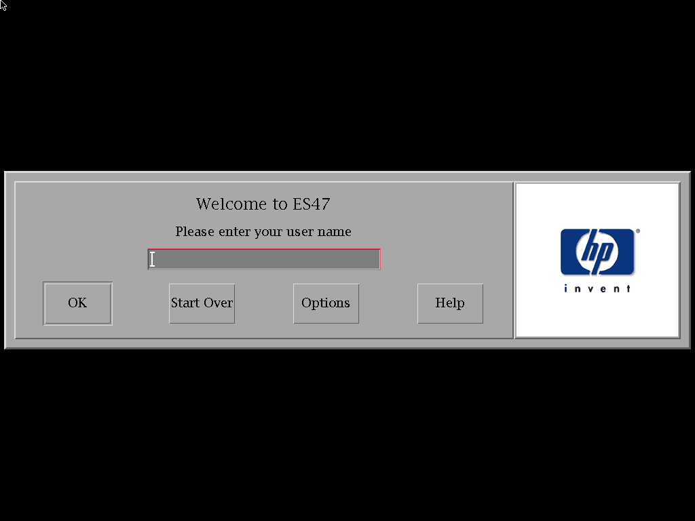

<p align="center">
  
</p>

**Alphabox brings DEC Alpha machines back from the dead.**

It doesn't merely execute Alpha instructions. It recreates the machines
around them -- the chipsets, the firmware, the buses and interrupt wiring,
the SCSI adapters, network cards and graphics chips -- closely enough that
software written for them a quarter of a century ago runs without noticing
the hardware is gone.

Boot DEC's own SRM console. Start AlphaBIOS from it. Install Windows 2000
and let Microsoft's own ATI driver find an emulated 3D Rage Pro and draw
Direct3D scenes on it. Boot OpenVMS on sixteen EV7 processors in a
machine that once filled a cabinet. And on a modern laptop, the Alpha you are
pretending to own runs faster than the real one ever did.

[](https://github.com/artur/alphabox/actions/workflows/build-test-and-artifact.yml)
[](LICENSE)

| OpenVMS 8.4 with the CDE desktop | Windows 2000 on two Alpha processors | Direct3D on an emulated ATI 3D Rage Pro |
|---|---|---|
|  |  |  |

## What is this?

Not a generic Alpha emulator. Alphabox emulates specific, real machines --
the AlphaServer ES40 first, and now ten of them, from the DS10 to the
GS1280 -- well enough that their original firmware, operating systems and
device drivers take them for the real thing:

- OpenVMS 8.4, Tru64 UNIX, NetBSD, Windows 2000, and the 64-bit Windows
  Microsoft built on the Alpha and never shipped
- the EV68 (21264) on the Tsunami and Titan chipsets, and the EV7 (21364)
  with its on-chip router, up to sixteen of them
- the cards' own VGA BIOSes, and Windows' own drivers for Symbios, QLogic,
  S3, Cirrus, ATI, 3Dlabs and DEC hardware
- Direct3D on graphics chips from 1998, USB 2.0, SMP
- about 3000 MIPS per emulated CPU on an Apple M3 Max

## Why?

In 1992 Digital Equipment Corporation shipped the Alpha 21064: a clean-sheet
64-bit RISC processor designed to last twenty-five years, and for most of
the decade the fastest microprocessor in the world. It ran OpenVMS, Digital
UNIX and Windows NT; Microsoft brought up its first 64-bit Windows on it.

Then Compaq bought Digital, HP bought Compaq, the road map went to Itanium,
and the last new Alpha appeared in 2004. The architecture outlived its
maker; the machines mostly didn't. They are rare now, their disks are
dying, and their software -- a whole branch of computing history -- is
running out of places to run.

Alphabox is one of those places.

## How real is it?

Alphabox doesn't hand the operating system a convenient abstraction. It
emulates the hardware, and lets the original software find it.

Windows 2000 loads its Symbios driver because it finds a Symbios 53C875 in
PCI configuration space. Its ATI driver runs because the chip answers like
a Rage Pro. AlphaBIOS runs the graphics card's own x86 VGA BIOS. OpenVMS
discovers an ES47 through the same console callbacks and management
processor it would on HP's hardware -- which meant working out, from the
console's code, a protocol HP never documented.

So the test of correctness is simple: **if the original driver doesn't
work, Alphabox is wrong.** A real driver asks questions a test never
thinks of, and most of the device bugs fixed here were found that way. Where
the emulated processor knowingly differs from a real 21264, it is written
down in [docs/cpu-fidelity.md](docs/cpu-fidelity.md).

## Things that shouldn't work, but do

| OpenVMS 8.4 on an emulated ES47: two EV7s, the CDE login on its Radeon 7500 | dxdiag: ATI's own Direct3D driver, every test passed | Windows 2000 reading a USB disk |
|---|---|---|
|  |  |  |

**Direct3D on Windows for Alpha.** The ATI 3D Rage Pro's triangle setup
engine, the 3Dlabs Permedia 2's delta unit and the S3 ViRGE's S3d engine
are emulated well enough that Windows 2000's own Direct3D drivers -- the
ones on the installation CD -- draw lit, textured, perspective-correct
scenes, checked pixel by pixel against Direct3D's software rasteriser.

**USB 2.0 on an operating system that never had it.** No Windows for Alpha
ever shipped a USB 2.0 driver; Microsoft's came after the Alpha was
dropped. So one was written, with *nada* -- a companion project, a C
compiler that targets Alpha Windows in user and kernel mode -- and Windows
2000 on the Alpha reads USB 2.0 disks today. The same toolchain produced
virtio drivers and a Radeon 7500 driver with a Direct3D 7 HAL for a card
Windows never supported on this architecture ([guest drivers](docs/guest-drivers.md)).

**The 64-bit Windows Microsoft never shipped.** Windows "Whistler" build
2210 for AXP64 -- the 64-bit Windows Microsoft developed on the Alpha
before moving to Itanium -- installs through AlphaBIOS and runs native
64-bit programs.

**Sixteen EV7s booting OpenVMS.** The EV7 put the memory controller and a
network router on the processor and replaced the chipset with I/O bridges
and a management processor on every board. Alphabox emulates that too: the
ES47 with two EV7s, the ES80 with eight and four I/O bridges, and the
GS1280 with sixteen, all booting OpenVMS 8.4 from an installed disk, with
network cards answering on every PCI bus.

## Fast enough to outrun the machine it emulates

Emulator speed is usually described as overhead. Alphabox has reached the
slightly strange point where it is the other way round: with its JIT on an
Apple M3 Max, one emulated CPU runs Alpha code at about **3000 MIPS** --
two to three times what the ES40's own 667 MHz EV68 managed in practice.
Over 99% of guest instructions execute as host code.

The changes that moved the clock furthest were rarely about executing code
faster. Two thirds of a Windows 2000 boot was a driver spinning on the cycle
counter for real time to pass; the firmware asked for an instruction-cache
flush millions of times without having written a byte of code; and every
interrupt that reached an idle guest waited for the next timer tick,
because Windows' idle loop opens interrupts for exactly one instruction.
Fixing those took the boot from 95 to 60 seconds, the console at its
prompt from 441 to 1681 MIPS, and a USB 2.0 disk read from a second to a
tenth of one. **Profile where the guest *waits* before optimizing how fast
it runs.**

The details are under [Performance](#performance) below.

## Why another Alpha emulator?

QEMU runs Alpha code too, and runs it well -- for Linux, with its own
PALcode and firmware in place of DEC's. Alphabox has a different goal:
**machine fidelity**. It runs DEC's and HP's genuine consoles, so it can run
the operating systems that depend on them -- OpenVMS, Tru64, Windows -- and
it emulates individual chips, so that the historical drivers for those
chips work. That is also why it covers machines no other emulator does,
like the EV7 systems, and why the guest software itself is the test oracle.

## How it got here

Alphabox began as performance work on AXPbox: an AArch64 JIT to make
Windows on an emulated Alpha comfortable to use on a Mac. Then Windows
exposed chipset bugs. Real graphics drivers exposed graphics bugs. USB
needed a driver the Alpha never had, and getting one meant a compiler. The
ES40 led to the other Tsunami and Titan machines, and those to the EV7,
which needed a different machine architecture entirely. Somewhere along
the way it stopped being a performance fork and became an attempt to keep
the Alpha's software running on the hardware it was written for -- in
software.

---

## What runs

| Guest | Status |
|---|---|
| OpenVMS | 8.4 installs from its CD, and boots to login on every emulated machine: up to four CPUs on the Tsunami and Titan boards, two to sixteen EV7s on the ES47, ES80 and GS1280; DECwindows draws the CDE login on the 3Dlabs Permedia 2 and the ATI Radeon 7500 (a session needs a DW-MOTIF licence) ([OpenVMS notes](docs/openvms.md), [installation guide](https://github.com/lenticularis39/axpbox/wiki/OpenVMS-installation-guide)) |
| Tru64 UNIX | Boots |
| NetBSD | Boots ([installation guide](https://github.com/lenticularis39/axpbox/wiki/NetBSD-9.2-install-guide)) |
| Windows NT / 2000 | Installs and runs through AlphaBIOS, on the S3, Cirrus, ATI Mach64, 3Dlabs Permedia 2 or S3 ViRGE/DX card with each card's own driver from the installation media (an installed Windows 2000 also takes the original ViRGE, the ViRGE/VX and the ViRGE/GX2, and the DEC TGA, ZLXp-E1, with its own tga driver); the Radeon 7500 with nada's driver; Windows 2000 on up to two CPUs; USB with its own drivers ([installation guide](https://web.archive.org/web/20260705122517/https://www.zx.net.nz/computers/dec/axpemu-es40.shtml)) |
| Windows "Whistler" 64-bit (AXP64, build 2210) | Installs and runs through AlphaBIOS, and runs native 64-bit programs |

See also the upstream [guest support](https://github.com/lenticularis39/axpbox/wiki/Guest-support)
page.

## Quick start

```
git clone --recurse-submodules https://github.com/artur/alphabox
cd alphabox
cmake -S . -B build
cmake --build build -j
./build/alphabox configure    # writes es40.cfg
./build/alphabox run
```

You also need an SRM console ROM image, and a VGA BIOS for the graphics
card. The [documentation](docs/README.md) covers the rest:

- [Building](docs/building.md) on Linux, macOS and Windows, and enabling the
  JIT
- [Running and configuring](docs/configuration.md): firmware, consoles,
  networking, media, hotkeys
- [Machines](docs/platforms.md): the boards besides the ES40, and how one is
  added
- [USB](docs/usb.md): the controllers, the tablet and keyboard, USB disks,
  passthrough
- [Headless operation and debug hooks](docs/headless.md)
- [Development and testing](docs/development.md)

## Emulated hardware

| Area | Devices |
|---|---|
| Machines | AlphaServer ES40, DS20E, DS20L and DS10 (Tsunami); ES45, DS25 and DS15 (Titan); ES47, ES80 and GS1280 (EV7, "Marvel") -- all boot OpenVMS 8.4 ([docs/platforms.md](docs/platforms.md)) |
| CPU | Alpha EV68CB (21264): 1–4 on the Tsunami and Titan machines; EV7 and EV7z (21364): 2 on the ES47, up to 8 on the ES80 and 16 on the GS1280 |
| Chipset | Tsunami/Typhoon (Cchip, Dchip, 2 × Pchip, TIG, DPR/RMC); Titan (Cchip, Dchip, PA-chips with G and A ports, TIG); Marvel (each EV7's on-chip router and memory controllers, IO7 I/O bridges, the CMM management processors over GIO) |
| Memory | 64 MB – 32 GB; on the EV7 machines, per processor at its own physical base |
| Storage | Symbios 53C810 / 53C825 / 53C875 / 53C895 / 53C896 (two channels) and QLogic ISP1020 / ISP1040 (KZPBA) / ISP1080 / ISP1240 (two buses on one function) SCSI; ALi M1543C and CMD 649 IDE (disks and ATAPI CD-ROM); 82077AA floppy; RAM disk; virtio-blk |
| ISA bridge | ALi M1543C: 8259 PIC, 8254 PIT, MC146818 RTC, 8237 DMA, SuperIO, PMU |
| Graphics | S3 Trio64 (with IBM 8514/A acceleration); Cirrus Logic CL-GD5430 / CL-GD5434 (with BitBLT); ATI Mach64 CT / 264VT2 / 264VT3 / 3D Rage II+ / 3D Rage Pro (drawing engine, hardware cursor, a monitor on the DDC lines, modes to 32 bpp; on the Rage Pro the triangle setup engine, for Direct3D); 3Dlabs Permedia 2 (its graphics processor and delta unit: 2D, and Direct3D with depth, texturing, fog and blending); S3 ViRGE / ViRGE/VX / ViRGE/DX / ViRGE/GX2 (the S3d engine: 2D, and Direct3D with depth, texturing, fog and blending; the streams processor's 24-bit modes and video overlay); DEC ZLXp-E1 (DECchip 21030 "TGA", 8 planes, Bt485: AlphaBIOS and the Windows 2000 desktop to 1280x1024); PowerStorm 3D30 and 4D20 (TGA2: 8 planes with a Bt485, and 32-bit true colour with an IBM RGB561; the Windows 2000 desktop to 1280x1024 and 1600x1200, beside a VGA card); ATI Radeon 7500 (RV200: its BIOS, the extended modes, the hardware cursor, the 2D engine, the command processor with its FIFO, microcode and GART, and the 3D engine with transform and lighting; the SRM console on the ES40 and in the ES47's AGP slot, DECwindows on OpenVMS, and nada's Windows 2000 driver with Direct3D -- [docs/radeon.md](docs/radeon.md)) |
| USB | the ALi M1543C's OHCI (USB 1.1, 3 ports), an EHCI card (USB 2.0, 4 ports, with OHCI companions) and the ES47's on-board Agere USS-344 (four OHCI functions); a HID tablet and keyboard, Bulk-Only mass storage, a USB Audio speaker, and host passthrough through libusb ([docs/usb.md](docs/usb.md)) |
| Network | DEC 21040 / 21041 / 21140 / 21143 (Tulip); Intel 82557/82558/82559 (DE600-AA) and the two-port DE602-AA / DE602-B boards behind a bridge; virtio-net -- host access through pcap, TUN/TAP (Linux), a UDP link or a null back end |
| Sound | Ensoniq AudioPCI ES1370 and ES1371 (AC'97 codec and sample-rate converter) |
| Expansion | DECchip 21050/21052/21152/21153/21154 PCI-PCI bridges (nested buses, multi-port boards) |
| Other | 2 × 16550 serial ports (telnet or unconnected), keyboard and PS/2 mouse, flash and NVRAM persistence |

[docs/peripherals.md](docs/peripherals.md) lists every device the ES40
firmware knows and which ones are coming next.

## Performance

With the JIT build on an Apple M3 Max, a Windows 2000 benchmark that
isolates one JIT datapath per section runs at about **3000 MIPS** per
emulated CPU (2200 to 4000 depending on the section), about 1.35 host
cycles per Alpha instruction. Microsoft's own code, which the benchmark
flatters less, runs at 1500 to 4000: `makecab` compressing 8 MB at about
1500 MIPS, JScript at 1500 to 3950 depending on what it does. The ES40's own
EV68 at 667 MHz managed roughly 1300 to 1500 in practice; the fastest Alpha
ever built, about 10300. An idle two-CPU Windows 2000 desktop uses a few
percent of one host core: idle pacing recognizes the guest's idle loop and
sleeps until an interrupt arrives.

Every figure comes from `test/tools/perf_ab.py` and its ledger: two arms
interleaved, the computed results checked identical, and small effects
measured inside one binary with a runtime switch -- two builds of the same
code differ by 5-10% per section from code layout alone.
[docs/performance.md](docs/performance.md) has the measurements, what
bounds which workload, and the optimizations that turned out not to pay.

## Known limitations

- More than two CPUs under Windows: Windows 2000 Professional is licensed
  for two, and the Windows 2000 Server beta HAL only sends inter-processor
  interrupts to CPUs 0–1. Tru64 is untested with more than one CPU.
- Big-endian hosts.
- Some SCSI and IDE commands. The ES47's on-board Adaptec AIC-7892 is
  stood in for by a Symbios 53C895, and the DS25's AIC-7899, Broadcom and
  Intel network chips and the ES45/DS25 hot-plug controllers are not
  modelled.
- Cirrus screen-to-system BitBLT transfers (Windows 2000 does not use them),
  and the Mach64's front-end scaler and bus-master DMA (Windows 2000's
  drivers use neither: stretched blits go through the 3D engine). The 3D
  Rage II+ has DirectDraw but no Direct3D, as Windows' own driver gives it
  none.
- The S3 ViRGE family: the Windows driver exposes no mipmaps, and the chips
  have no alpha test, no texture clamping, no specular colour and only square
  textures, so Direct3D scenes using those differ from Microsoft's software
  rasteriser; the driver draws lines as thin triangles whose colour does not
  follow the line. The ViRGE, ViRGE/VX, ViRGE/DX and ViRGE/GX2 are verified;
  the GX, which shares the DX's device ID, has not been run on its own. The
  VX's Windows driver offers no video overlay.
- The TGA (ZLXp-E1) is no SRM console: SRM V7.3-1 lists it but has no
  driver for it. Windows 2000's driver draws only in simple mode, so the
  21030's other drawing modes are unverified by any guest; the 24-plane
  E2/E3 are not modelled. The TGA2 (PowerStorm 3D30/4D20) runs only beside
  a VGA card, which stands in for the board's own Cirrus VGA: neither
  AlphaBIOS nor SRM drives a TGA2 itself.
- The Permedia 2 is no SRM console: SRM V7.3-1 starts a card's BIOS without
  telling it where the card is, and every ELSA and 3Dlabs BIOS checks that
  before doing anything. AlphaBIOS starts it properly, so Windows is
  unaffected. Its video streams unit is not modelled.
- The Radeon 7500: no Windows for Alpha shipped a driver for it; without
  nada's driver Windows runs it as a standard VGA. Its 3D engine is checked
  by a self-test and by that driver, not against a real card: where a pixel
  centre falls exactly on a texel boundary, and how the chip does its
  triangle-setup arithmetic, are not documented anywhere
  ([docs/radeon.md](docs/radeon.md)).
- USB: OpenVMS uses only the first three functions of a USB controller, so
  devices on the ES47's on-board USB go on ports 1–3; on macOS, host
  devices a system driver holds cannot be passed through.
- The guest's cycle counter runs ahead of real time: a driver busy-waiting on
  `RPCC` is handed the cycles it is waiting for instead of spinning through
  them. A guest that compares `RPCC` against the interval timer therefore
  sees a faster processor than the one configured; time of day is
  unaffected. `ALPHABOX_STALL_SKIP=0` restores the real wait. Every knowing
  divergence from a real 21264 is listed in
  [docs/cpu-fidelity.md](docs/cpu-fidelity.md).

## History and acknowledgements

Alphabox began as **es40**, the emulator by **Camiel Vanderhoeven** and the
ES40 Emulator Project (2007–2010), with later work by **Tim Stark**
(fsword7). **Tomáš Glozar** revived it as
[AXPbox](https://github.com/lenticularis39/axpbox) — CMake, a single binary,
modern C++ threading and many crash fixes — with **Remy van Elst**. The
[ES40-Emu](https://github.com/ES40-Emu/es40) project (gdwnldsKSC) continues
es40 in parallel and is a welcome source of ideas: each of its changes is
reviewed on its merits here and adopted, adapted or improved.

This repository continued AXPbox as its own project and was renamed Alphabox
in 2026. Its work includes the AArch64 JIT and the performance work behind
it, idle pacing, SMP and memory fixes, the headless test tooling, USB, the
machines beyond the ES40 -- the Tsunami and Titan boards and the EV7
systems -- and most of the device families above: the Symbios 53C8xx and
QLogic ISP SCSI adapters, the Tulip and Intel 8255x network cards, the
PCI-PCI bridges and the multi-port boards built on them, the Ensoniq sound
cards, and the Cirrus Logic, ATI Mach64, S3 ViRGE, 3Dlabs Permedia 2, DEC
TGA and ATI Radeon graphics cards with their drawing engines.

Alphabox builds on the work of others:

- **MAME** — the VGA core and IBM 8514/A emulation (Barry Rodewald, Aaron
  Giles, Vas Crabb, Olivier Galibert; BSD-3-Clause).
- **Bochs** — the GUI layer (MandrakeSoft) and parts of the disk and CD-ROM
  command handling.
- **QEMU** — the ES1370 sound device (Vassili Karpov); its Cirrus model was
  the behavioural reference and the test oracle for the Cirrus blitter, and
  its ati-vga model (BALATON Zoltan) a register reference for the Radeon.
- **POCO** — the original threading wrappers (Applied Informatics), since
  replaced by the C++ standard library.
- **86Box** — the ATI Mach64 drawing engine is ported from it (Sarah Walker,
  Miran Grca, Connor Hyde; GPL-2); its ROM set supplies the VGA BIOS images,
  and its Cirrus model was a reference.
- **Mesa**, the **Linux** radeon driver and **X.org**'s radeon driver — the
  register semantics the Radeon 7500 model follows, as AMD never published
  an R100 3D reference.
- **SDL3**, **asmjit**, **libpcap**, **Npcap** and **libusb**.

Guest-visible identifiers (disk serial numbers, the `es40.cfg` file name, the
machine type) deliberately keep their ES40 names.

## License

GNU General Public License, version 2 or later — see [LICENSE](LICENSE).
Third-party code keeps its original license, as noted in the source file
headers.
